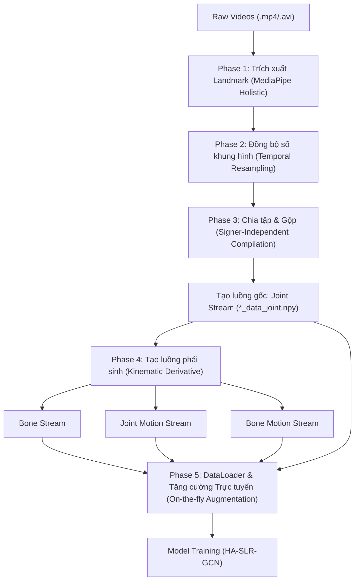

# Chi Tiết Pipeline Tiền Xử Lý, Chuẩn Hóa và Tăng Cường Dữ Liệu HA-SLR-GCN

Tài liệu này mô tả chi tiết toàn bộ quá trình xử lý dữ liệu từ Video thô (Raw Videos) thành các luồng dữ liệu 4 nhánh (4-Stream Kinematic Representation) và các cơ chế tăng cường dữ liệu hình học trực tiếp (On-the-fly Data Augmentation) dùng trong mô hình nhận dạng ngôn ngữ ký hiệu **HA-SLR-GCN**.

---

## Tổng Quan Luồng Xử Lý (Data Pipeline)

---

## Chi Tiết Từng Giai Đoạn (Phases)

### Phase 1: Trích xuất Landmark (MediaPipe Holistic)
- **Mục tiêu**: Chuyển đổi video RGB dạng pixel thành tọa độ không gian 3D của các khớp xương quan trọng nhất cho ngôn ngữ ký hiệu.
- **Thư viện**: `MediaPipe Holistic` (tự động tích hợp nhận dạng Pose, Face, và Hands).
- **Cấu trúc 27 điểm khớp (27 Keypoints)**:
  Để tối ưu hóa hiệu năng tính toán và loại bỏ các khớp không liên quan (ví dụ: chân), hệ thống trích xuất chính xác 27 khớp xương:
  1. **Body Pose (7 khớp)**:
     - MediaPipe indices: `[0, 11, 12, 13, 14, 15, 16]` (Mũi, Vai trái, Vai phải, Khuỷu tay trái, Khuỷu tay phải, Cổ tay trái, Cổ tay phải).
  2. **Bàn tay trái - Left Hand (10 khớp)**:
     - MediaPipe indices: `[0, 4, 5, 8, 9, 12, 13, 16, 17, 20]` (Cổ tay, Đầu ngón cái, Khớp gốc ngón trỏ, Đầu ngón trỏ, Khớp gốc ngón giữa, Đầu ngón giữa, Khớp gốc ngón áp út, Đầu ngón áp út, Khớp gốc ngón út, Đầu ngón út).
  3. **Bàn tay phải - Right Hand (10 khớp)**:
     - Sử dụng 10 chỉ số tương tự như bàn tay trái.
- **Chuẩn hóa Tọa độ Cục bộ (Nose-Centered Normalization)**:
  - Để triệt tiêu sai số do người ký đứng ở các vị trí khác nhau trước camera, tọa độ của tất cả các điểm khớp trong mỗi khung hình được chuyển về tọa độ tương đối so với mũi (Nose):
    $$P_{i, t}^{\text{aligned}} = P_{i, t} - P_{\text{nose}, t}$$
- **Mã nguồn liên quan**: [Preprocess/demo.py](file:///mnt/nvme2/users/utbt_sv1/HASLR/HA-SLR/Code/Network/SL_GCN/Preprocess/demo.py#L31-L78).

---

### Phase 2: Đồng bộ hóa Số lượng Khung hình (Temporal Resampling)
- **Mục tiêu**: Đồng bộ tất cả chuỗi xương về một độ dài cố định là `max_frame = 150` khung hình nhằm tương thích với kiến trúc mạng GCN cố định chiều.
- **Cơ chế xử lý**:
  - **Nén thời gian (Downsampling)**: Nếu video gốc có số khung hình $L > 150$, tiến hành lấy mẫu đều các khung hình bằng phương pháp chia khoảng tuyến tính:
    $$\text{indices} = \text{np.linspace}(0, L - 1, 150, \text{dtype=int})$$
  - **Kéo dài thời gian (Padding/Looping)**: Nếu video gốc có số khung hình $L < 150$, thực hiện lặp tuần hoàn (border loop replication) các khung hình cho đến khi đạt đủ 150:
    $$\text{new\_sequence} = \text{concatenate}([\text{sequence}, \text{sequence}[:150-L]], \text{axis}=0)$$
- **Mã nguồn liên quan**: [Preprocess/demo.py](file:///mnt/nvme2/users/utbt_sv1/HASLR/HA-SLR/Code/Network/SL_GCN/Preprocess/demo.py#L80-L96).

---

### Phase 3: Chia tập Độc lập và Gộp dữ liệu (Compilation & Splitting)
- **Độc lập người ký (Signer-Independent)**:
  Để đánh giá mô hình một cách khách quan nhất, tập dữ liệu được phân tách hoàn toàn theo ID của người ký (Signer ID - trích xuất từ 2 chữ số đầu tiên của tên file video):
  - **Train Set (Mẫu huấn luyện)**: Người ký `01` đến `24`
  - **Val Set (Mẫu xác thực)**: Người ký `25` đến `27`
  - **Test Set (Mẫu kiểm thử)**: Người ký `28` đến `31`
- **Gộp dữ liệu (Dataset Compilation)**:
  - Các tệp tin `.npy` của từng mẫu lẻ được gộp lại thành một mảng Numpy 5 chiều lớn:
    $$\text{Shape: } (N, 3, 150, 27, 1) \quad [N_{\text{samples}}, C_{\text{channels}}, T_{\text{frames}}, V_{\text{joints}}, M_{\text{persons}}]$$
  - Danh sách tên mẫu và nhãn số tương ứng được đóng gói thành tệp tin nhãn `.pkl`:
    $$\text{pkl\_content} = (\text{list\_of\_sample\_names}, \text{list\_of\_labels})$$
- **Mã nguồn liên quan**: [Preprocess/preprocess_multivsl200.py](file:///mnt/nvme2/users/utbt_sv1/HASLR/HA-SLR/Code/Network/SL_GCN/Preprocess/preprocess_multivsl200.py#L65-L131).

---

### Phase 4: Sinh các Luồng Động học Phái sinh (Offline Derived Streams)
Từ luồng dữ liệu gốc **Joint** (Vị trí tọa độ khớp), hệ thống tự động tính toán ra 3 luồng động học phái sinh ngoại tuyến nhằm thu thập các góc nhìn vật lý khác nhau của chuyển động:

1. **Luồng Bone (Xương)**:
   - Đại diện cho hướng vector và chiều dài của các đốt xương liên kết giữa hai khớp.
   - Công thức tính toán vector hướng xương chuẩn hóa L2:
     $$B_{j, t} = \frac{J_{j, t} - J_{\text{parent}(j), t}}{\|J_{j, t} - J_{\text{parent}(j), t}\|_2}$$
   - *parent(j)* được tra cứu từ bảng liên kết 27 keypoints xương. Với khớp gốc (Wrist), vector xương được mặc định gán bằng 0.

2. **Luồng Joint Motion (Chuyển động Khớp)**:
   - Đại diện cho vận tốc tức thời (sự thay đổi vị trí) của các khớp xương qua thời gian:
     $$M^{\text{joint}}_{i, t} = J_{i, t+1} - J_{i, t}$$
   - Khung hình cuối cùng $T-1$ được sao chép từ khung hình $T-2$ để bảo toàn chiều thời gian.

3. **Luồng Bone Motion (Chuyển động Xương)**:
   - Đại diện cho tốc độ thay đổi góc quay / hướng của các đốt xương qua thời gian:
     $$M^{\text{bone}}_{j, t} = B_{j, t+1} - B_{j, t}$$
   - Khung hình cuối cùng $T-1$ được sao chép tương tự như Joint Motion.

- **Mã nguồn liên quan**: [Preprocess/preprocess_multivsl200.py](file:///mnt/nvme2/users/utbt_sv1/HASLR/HA-SLR/Code/Network/SL_GCN/Preprocess/preprocess_multivsl200.py#L133-L199).

---

### Phase 5: Tăng cường và Chuẩn hóa Trực tuyến (On-the-fly Augmentations)
Trong quá trình huấn luyện, lớp `Feeder` của PyTorch DataLoader sẽ áp dụng động các phép biến đổi ngẫu nhiên và chuẩn hóa cho từng mini-batch dữ liệu đầu vào:

1. **Random Choose (Lấy mẫu thời gian ngẫu nhiên)**:
   - Cắt ngẫu nhiên một đoạn gồm `window_size` khung hình liên tục từ chuỗi 150 khung hình gốc để mô phỏng sự biến thiên tốc độ thực hiện cử chỉ.

2. **Random Mirror (Lật đối xứng ngẫu nhiên)**:
   - Với xác suất $p=0.5$, lật đối xứng cơ thể và hai tay qua trục dọc.
   - Các khớp tay trái và tay phải được hoán đổi chỉ số cho nhau bằng mảng hoán vị `flip_index`.
   - Tọa độ trục X được biến đổi ngược: $x \leftarrow 512 - x$ đối với Joint (coi ảnh gốc là $512 \times 512$), hoặc đảo dấu $x \leftarrow -x$ đối với các luồng dạng vector (Bone, Motion).

3. **Normalization (Chuẩn hóa vị trí)**:
   - Đưa tâm của cơ thể về trục gốc bằng cách trừ đi giá trị trung bình của khớp cổ tay gốc trong khung hình đầu tiên của chuỗi cử chỉ.

4. **Random Shift (Dịch chuyển ngẫu nhiên)**:
   - Cộng thêm một giá trị nhiễu dịch chuyển ngẫu nhiên $\Delta x, \Delta y \in [-10, 10]$ pixel vào toàn bộ chuỗi cử chỉ để tạo sự dịch vị trí camera ngẫu nhiên.

5. **Random Move (Biến đổi hình học ngẫu nhiên)**:
   - Áp dụng các ma trận biến đổi affine ngẫu nhiên gồm:
     - **Quay ngẫu nhiên**: Chọn ngẫu nhiên góc quay $\theta \in \{-10^\circ, -5^\circ, 0^\circ, 5^\circ, 10^\circ\}$.
     - **Co giãn ngẫu nhiên**: Chọn hệ số phóng to/thu nhỏ $s \in \{0.9, 1.0, 1.1\}$.
     - **Tịnh tiến ngẫu nhiên**: Chọn khoảng dịch chuyển tịnh tiến $t_x, t_y \in \{-0.2, -0.1, 0.0, 0.1, 0.2\}$.
   - Các tham số biến đổi được nội suy tuyến tính (`np.linspace`) xuyên suốt chiều thời gian $T$, giúp chuỗi skeleton chuyển động mềm mại tự nhiên chứ không bị giật lag giữa các khung hình.

6. **JDMA (Geometric Data Mixup Augmentation)**:
   - Lấy cảm hứng từ thuật toán Mixup trên không gian tọa độ cử chỉ. Lấy một mẫu ngẫu nhiên thứ hai trong tập dữ liệu, áp dụng các phép biến đổi tương tự, sau đó thực hiện tổ hợp lồi tuyến tính:
     $$X_{\text{mixed}} = \lambda X_1 + (1 - \lambda) X_2$$
   - Với $\lambda \sim \text{Beta}(0.1, 0.1)$ (giá trị phân phối Beta hẹp giúp chỉ sinh ra khoảng 10% nhiễu hình học từ mẫu thứ hai).
   - **Chú ý**: JDMA chỉ được áp dụng trên các luồng tĩnh (**Joint** và **Bone**) và được tắt trên các luồng động (**Motion**) để tránh tạo ra các quỹ đạo chuyển động ma (Ghost Trajectories).
   - Nhãn đầu ra được chuyển đổi thành nhãn mềm (Soft Label): `[label_1, label_2, lambda]`.

- **Mã nguồn liên quan**: [feeders/feeder_cvpr.py](file:///mnt/nvme2/users/utbt_sv1/HASLR/HA-SLR/Code/Network/SL_GCN/feeders/feeder_cvpr.py#L103-L192) và [feeders/tools.py](file:///mnt/nvme2/users/utbt_sv1/HASLR/HA-SLR/Code/Network/SL_GCN/feeders/tools.py#L65-L127).
